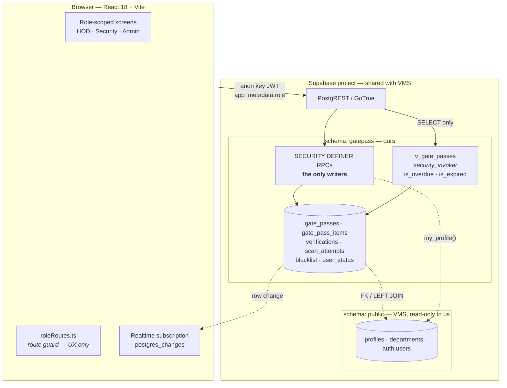
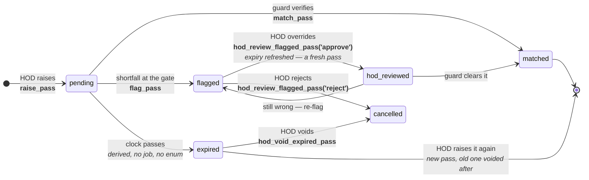
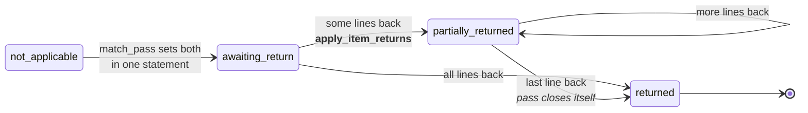
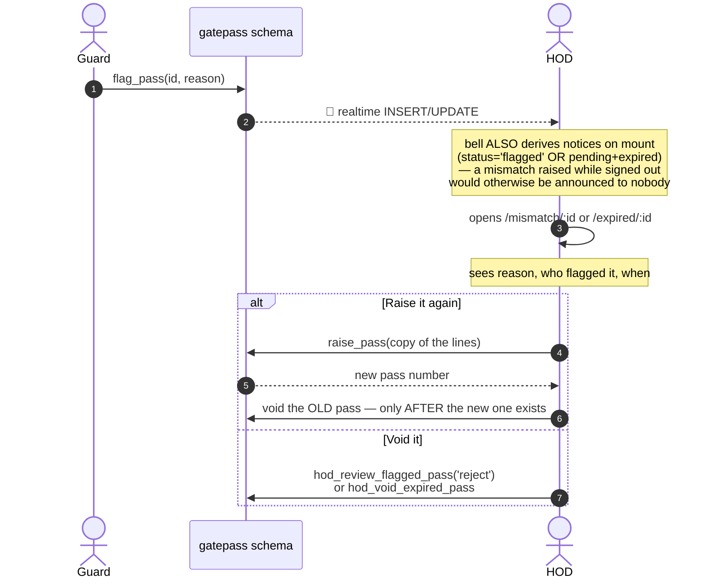
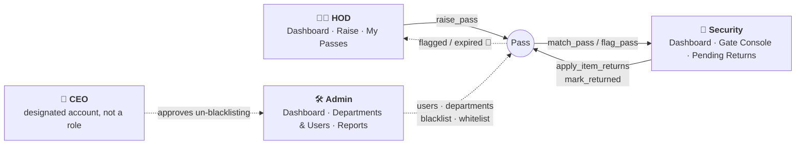
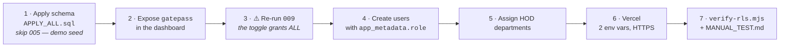

<div align="center">

# GatePass

**Material Gate Pass System for a shopping mall's Mall Management Office**

Department heads raise passes for material moving through the service gate / loading bay.
Security verifies each one physically and either **matches** it or **flags** it.
Everything is timestamped, attributable, and auditable.


</div>

---

## Why it is built this way

A gate pass is a promise about physical material: *this much of this thing, leaving with this
person, in this vehicle, and — if it is returnable — coming back by this date.* The failure mode
is not a bug; it is a contractor's van leaving the loading bay with the wrong equipment and
nobody able to prove it afterwards. Three properties follow:

| Property | How it is guaranteed |
|---|---|
| **The gate log cannot be retro-edited** | No client holds `UPDATE`/`DELETE` on `gate_passes`. Every state change goes through a `SECURITY DEFINER` RPC that decides which columns may move. |
| **A pass is visible only to those who should see it** | Row Level Security scopes each HOD to their department and each guard to the gate. The route guard in `App.tsx` is UX, **not** the boundary. |
| **What was *tried* is recorded, not just what succeeded** | `verifications` logs successful gate actions; `scan_attempts` logs *every* scan, including forged and expired ones. |

---

## Architecture at a glance



**The two-schema rule.** `public` belongs to a separate VMS visitor system and is treated as
read-only; `gatepass` is ours. Query through `gp()` / `pub()` in `src/supabaseClient.ts` — there
is deliberately no default-schema shortcut, so a reader always sees which schema a query hits.
**Never write a migration that alters `public`.**

**Derived, never stored, never recomputed in TypeScript:** `is_overdue`, `is_expired`, and
`due_state` are defined exactly once, in `v_gate_passes`. A screen that disagrees with
`match_pass` about expiry is a guard arguing with a driver.

---

## The pass model

Two independent facts, not one conflated type:

```
type      = does it come back?      RGP | NRGP
direction = which way is it going?  in  | out
```

**Exactly three combinations are legal**, enforced by check constraints rather than by the
dropdown:

| Category | Meaning | Return leg |
|---|---|---|
| `RGP-out` | The mall's own equipment leaving and coming back — a chiller pump out for repair, an LED wall out to a vendor. | ✅ |
| `RGP-in` | Someone else's equipment coming in and going back out — a fit-out contractor's scaffolding, scissor lift, power tools. | ✅ |
| `NRGP-out` | Material leaving for good — scrap, waste, disposal, a tenant removing fixtures. | ❌ pinned to `not_applicable` |

**NRGP is outward-only.** Permanently inbound material is a goods receipt, not a gate pass: the
gate never had custody, so the gate log must not claim it did.

Pass numbers carry the direction — `RGP-OUT-20260727-0001` — and are generated under an advisory
lock, so concurrent inserts cannot collide.

---

## Business workflows

### 1 · The outward trip



*An expired pass is **null and void from the moment the clock passes** — `match_pass` has refused
one since migration `008`. What `041` added is a way to **close** it: the raising HOD is notified
and given exactly two decisions. Expiry is derived at query time, so there is no `pg_cron` job and
no `expired` enum label — and no realtime event either, which is why the bell also derives its
notices on mount.*

### 2 · The RGP return leg — a second, independent axis

`status` describes only the outward trip and freezes at `matched`. `return_status` is what moves
afterwards, so a pass still standing outside and one closed weeks ago are both `matched`.



Two rules the UI must not re-derive: **the roll-up decides closure**, not TypeScript — the client
re-reads the pass rather than computing "everything is back"; and **a guard cannot undo a recorded
return.** Ticks are undoable up to the Record press; after it, the record stands. Reversal is an
admin/DB action with a human deciding it, never a control at the barrier.

### 3 · The mismatch and expiry loop — the HOD is told, and given a decision



**Order of operations is load-bearing.** Voiding on the button press would destroy the record of
what the gate stopped for anyone who then closed the tab, and leave the gate with nothing if the
replacement were never submitted. A failed supersede is a **warning**, never a submit error — the
new pass exists either way.

### 4 · Who does what



---

## Roles and access

Roles are **not** app-specific — this app maps onto VMS's shared `public.user_role` enum.

| In this app | `profiles.role` | Lands on | Can do |
|---|---|---|---|
| Security | `guard` | `/guard-dashboard` | Scan, match, flag, record returns |
| HOD | `hod` | `/dashboard` | Raise passes for their department, decide a flagged or expired pass |
| Admin | `admin` / `super_admin` | `/admin-dashboard` | Users, departments, blacklist, reports |
| No access | `staff` | `/no-access` | Nothing |

- Role comes from the JWT's **`app_metadata.role`** (server-writable only), with a
  `gatepass.my_profile()` fallback. **Never authorize off `user_metadata`** — users can write it.
- **A raised gate pass is permanent** (migration `024`). There is no cancel, no delete, no HOD
  void of a live pass — only the two decisions above, on a pass the gate or the clock already
  stopped.
- **A person belongs to at most one department** (`032`, unique index), mirrored into VMS's
  `profiles.department_id` so both apps agree. A department may still host several HODs.
- **Deactivation is a status, not a role** (`040`). `gatepass.user_status` holds the flag;
  `app_role()` and `my_department_ids()` both consult it, so a suspended person is shut out by
  the database even though their JWT is still valid. Their role and department survive intact.
- Consequence worth knowing before go-live: **every existing VMS guard automatically has gate
  console access**, and every VMS HOD can raise passes once assigned a department.

---

## The state machine — every writer, in one table

No client holds `UPDATE` on `gate_passes`. These are the only ways a pass moves.

| RPC | Who | What it does |
|---|---|---|
| `raise_pass` | HOD | Creates the pass + its item lines. Blacklist is enforced by a **BEFORE INSERT trigger**, so every insert path is covered. |
| `match_pass` | guard | Clears the outward trip; refuses an expired pass; opens the return leg for an RGP. |
| `flag_pass` | guard | Records a mismatch. **Deliberately admits an expired pass** — refusing to record a real mismatch because the paperwork went stale is backwards. |
| `apply_item_returns` / `mark_returned` | guard | Per-line or whole-pass return. Only ever *adds* to `returned_qty`; `returned_at` is written through `coalesce` and can never be moved. |
| `hod_review_flagged_pass` | raising HOD | `approve` → `hod_reviewed` + refreshed expiry. `reject` → `cancelled`. Both write a `verifications` row. |
| `hod_void_expired_pass` | raising HOD | Closes a pass that expired unused. **Re-checks `expires_at < now()` on the server** — without that, the browser could void a live pass by calling the RPC directly. |
| `lookup_pass` | guard | QR/number lookup at the barrier, with the vendor's blacklist status attached. |
| `admin_create_user` · `admin_update_user` · `admin_soft_delete_user` · `admin_reactivate_user` | admin | User management. Guard and HOD only — `staff` is not writable from the portal. |
| `request_vendor_whitelist` → `approve_whitelist_request` | admin → **CEO** | Taking a vendor off the blacklist needs a justification and a second pair of eyes. `remove_blacklist_entry` was **dropped**, not left beside it. |

---

## Quick start

```bash
npm install
cp .env.example .env      # fill in your Supabase URL and anon key
npm run dev               # http://localhost:5174
```

```ini
VITE_SUPABASE_URL=https://<project-ref>.supabase.co
VITE_SUPABASE_ANON_KEY=<anon key>
```

> `SUPABASE_SERVICE_ROLE_KEY` is needed only by node scripts under `scripts/`.
> **Never give it a `VITE_` prefix** — Vite inlines every `VITE_*` variable into the public
> browser bundle, and that key bypasses RLS entirely.
> `tests/security/clientSecrets.test.ts` fails the build if it appears under `src/`.

### Commands

```bash
npm run check          # tsc -p tsconfig.app.json --noEmit && vitest run   ← THE gate
npm run dev            # dev server on :5174
npm run build          # typecheck + vite build
npm run build:sql      # regenerate supabase/APPLY_ALL.sql from migrations/
npx vitest run tests/unit/roleRoutes.test.ts          # a single spec

npm run create-user -- --email x@y.z --password P --name "N" --role hod --dept IT
node scripts/verify-rls.mjs                           # live RLS checks, real anon-key JWTs
```

> ⚠️ **`npm run lint` is a no-op — do not trust it.** It runs bare `tsc --noEmit`, which picks up
> the root `tsconfig.json`, and that file is `{"files": [], "references": [...]}`. Project
> references are not followed without `--build`, so it type-checks **zero files** and always exits
> 0. It once passed cleanly while `PassDetail.tsx` had a real missing-enum-key error. **Use
> `npm run check`.**

> ⚠️ **After editing anything in `supabase/migrations/`, run `npm run build:sql`.**
> `APPLY_ALL.sql` is the artifact a human pastes; a migration edited but not re-concatenated is a
> fix that never reaches the database. `tests/security/applyAllIntegrity.test.ts` is the backstop.

---

## Deployment



| Step | Detail |
|---|---|
| **Schema** | Paste `supabase/APPLY_ALL.sql` (one transaction), or `psql --single-transaction -v ON_ERROR_STOP=1 -f` each migration `001`→`041` over the **session pooler** — the direct `db.<ref>.supabase.co` host is IPv6-only. Percent-encode `@` in the password as `%40`. |
| **Exposed schemas** | Required, or PostgREST returns `PGRST106` for every query. **Toggling it also runs `grant all … to anon, authenticated, service_role`** — which hands out `UPDATE`/`DELETE` on `gate_passes` and destroys the core invariant. Re-run `009` afterwards, every time. |
| **Env vars on Vercel** | Exactly two: `VITE_SUPABASE_URL`, `VITE_SUPABASE_ANON_KEY`. Nothing else. |
| **SPA rewrite** | `vercel.json` rewrites everything but `/assets/` to `index.html` — `BrowserRouter` deep links like `/pass/<uuid>` would 404 on refresh, and a guard reloading the verify screen mid-shift is exactly who hits that. |
| **Headers** | HSTS, `nosniff`, `X-Frame-Options: DENY`, `frame-ancestors 'none'`, and **`Permissions-Policy: camera=(self)`** — load-bearing for the QR scanner. |
| **CSP** | ⚠️ **Applies only in production.** The Vite dev server sends none, so anything the policy blocks works perfectly on localhost and fails silently once deployed. This shipped once: avatars were invisible because the Supabase origin was missing from `img-src`. **Any new remote origin needs its directive added in the same commit.** `tests/security/cspAllowsSupabase.test.ts` pins them. |
| **Rollback** | The frontend rolls back by redeploying. **The database does not** — migrations are forward-only, with no down-migrations. Back up first. |

### The camera scanner needs HTTPS — the most likely deployment failure

`getUserMedia` exists only in a secure context. `localhost` qualifies; `http://<lan-ip>:5175` from
a phone **does not** — the API is not blocked, it is entirely absent, so it looks like a broken
build. The scan path therefore cannot be tested over LAN HTTP at all. `qrDecode.ts` prefers the
native `BarcodeDetector` and lazy-loads `jsqr` otherwise — that fallback is the whole iOS/Safari
story. **The typed pass-number field stays mounted beside the scanner**, always: cameras fail at a
night-time loading bay.

### Error codes tell you which layer failed

| Code | Layer | Fix |
|---|---|---|
| `PGRST106 Invalid schema` | `gatepass` not in Exposed schemas | Dashboard setting — then re-run `009` |
| `PGRST205` / `PGRST202` | Not in PostgREST's **schema cache** | Genuinely missing **or** a stale cache. Query `pg_catalog` before concluding a migration never ran. |
| `42501 permission denied for schema gatepass` | Missing GRANT | Schema `USAGE` is checked before table privileges, which is why it names the schema. Re-run `009`. |
| `42P17 infinite recursion … profiles` | VMS's recursive policy | Migration `006` makes GatePass immune — something is reading `public.profiles` directly instead of via `my_profile()`. |

---

## Project layout

```
src/
  App.tsx                routing · session/role resolution · route guard
  supabaseClient.ts      the one client; gp() and pub() schema helpers
  types/                 shared types; mirrors the Postgres enums exactly
  lib/                   lookup maps, formatters, drill/KPI catalogues, no fuzzy enum matching
  components/
    board/               GateBoard — the shared admin + HOD dashboard, every figure drillable
    charts/              DonutChart · TrendChart · BarList · chartPalette (the one hex exemption)
    layout/              AppShell · Sidebar · NotificationBell
  pages/
    HOD/                 Dashboard · RaisePass · MyPasses · MismatchReview · ExpiredReview
    Security/            GuardDashboard · GateConsole · Verify · PendingReturns · ItemReturnList
    Admin/               AdminDashboard · AdminPanel + tabs · ReportsPage
    Shared/              PassDetail · PassPrint · Profile
supabase/
  migrations/            001 → 041, applied in order
  APPLY_ALL.sql          generated; the file a human pastes
scripts/                 create-user · verify-rls · verify-0NN probes · build-apply-all
tests/
  unit/                  screens, lookup maps, routing, formatting, theme audit
  security/              static invariants over source and SQL — no database required
docs/                    ARCHITECTURE · DATABASE · SECURITY · DEPLOYMENT
```

---

## Conventions

| Rule | Why |
|---|---|
| **Max 300 lines per file** | Extract sub-components instead. No exceptions. |
| **No fuzzy string matching on enums** | Use a `Record<Enum, T>` map, never an `includes()` chain — a new enum value must be a type error, not a silent fallthrough. |
| **Never `alert` / `confirm` / `prompt`** | They block the page and break automation. Use inline panels or `.modal-overlay`. (`window.print()` is fine, click-triggered.) |
| **Every list handles loading · empty · populated** | `.skeleton`, `.empty-state`, then content. Explicitly, all three. |
| **A KPI's number is `rows.length` of the list its click opens** | Both from the same filtered array. Never a separate `count: 'exact'` query — a count that can disagree with its own list eventually will. |
| **Never leave unused schema in place** | An unused function is still `EXECUTE`-able over PostgREST and nobody reviews it. Drop what a feature retired in the migration that retired it. |
| **TDD, in a loop** | Write the failing test, watch it fail *for the right reason*, then the smallest code that passes. This applies to SQL too — `tests/security/sqlInvariants.test.ts` is how a migration is tested without a database, extended in the same commit as the migration. |

---

## Design system — Quest Gold + Charcoal

Seven colours, and **saturated colour means status, never decoration**.

```
Shell     #16161A   sidebar — dark in BOTH themes (chrome, not content)
Primary   #C6A15B   brass gold    buttons, active nav, focus
Accent    #2B3FA0   royal blue    links, secondary emphasis
Status    amber pending · emerald matched · red flagged · orange overdue
Neutral   navy-* / surface-*  warm stone ramp — meta, borders, baselines
Display   Antic Didone (serif, ONE weight) — headings, wordmark
```

- **Headings are a different face *and* a different colour from body text.** Every rung —
  `.page-title` 28 · `.section-title` / `.modal-title` 22 · `.card-title` /
  `.board-section-title` 18 — is Antic Didone in the brass gold (`brand-800`, `dark:brand-300`);
  body text is Inter in warm stone. The `dark:` half is load-bearing: the brand steps are literal
  hex and do **not** invert with the theme. Ink gold ≠ fill gold — `brand-600` is the button and
  reads ~2.2:1 as text. `tests/unit/headingIdentity.test.ts` computes the ratios from the real
  tokens and fails below AA; the print block forces every heading back to `#111` on paper.
- **On the dashboard every heading carries a gold rule marker** (`.board-accent`) — board title,
  the three KPI bands, all five chart panels — so the board's structure is scannable rather than a
  wall of tiles. `tests/unit/boardHeadings.test.tsx` fails if any of them reverts to the 11px grey
  eyebrow they used to be.
- **Text on gold is charcoal, never white.** White on `#C6A15B` is ~2.4:1 and fails AA; charcoal
  is ~9.1:1.
- **Never `font-bold` on `font-display`.** Antic Didone ships weight 400 only — bolding synthesises
  a smeared faux-bold. Presence comes from size and tracking.
- **Fixed-context surfaces use literal colours, not tokens.** The neutral ramp *inverts* under
  `.dark`, which is the shipped default, so anything always-light — the login card, the printed
  slip — renders near-white on near-white if tokenised. `tests/unit/themeAudit.test.ts` pins it.
- **No chart draws in the brand gold.** Gold is the sidebar's active link and the primary button; a
  slice drawn in it reads as frame, not as a category. `chartPalette.ts` is the *only* module in
  `src/` allowed literal hex, and the theme audit enforces that by name.
- **The printed slip is black-on-white with no colour-dependent information** — it must read on a
  cheap mono laser printer.
- **Guard controls are deliberately oversized.** Someone uses them standing at a loading bay, at
  night, one-handed, with a contractor's van waiting.

---

## Documentation

| Doc | What is in it |
|---|---|
| [docs/ARCHITECTURE.md](docs/ARCHITECTURE.md) | System shape, the two-schema rule, the RPC-only state machine, routing, realtime, frontend module map |
| [docs/DATABASE.md](docs/DATABASE.md) | Every table, enum, constraint, index, function, view, policy and grant — and what each migration did |
| [docs/SECURITY.md](docs/SECURITY.md) | Threat model, the invariants that must not break, how they are tested, and how they have broken before |
| [docs/DEPLOYMENT.md](docs/DEPLOYMENT.md) | Vercel setup, environment variables, why the camera needs HTTPS, troubleshooting |
| [MANUAL_TEST.md](MANUAL_TEST.md) | Ordered manual walkthrough — real browsers, realtime across two windows, printing, cameras |
| [CLAUDE.md](CLAUDE.md) | Working notes and session handoff state for AI-assisted development |

---

## Status

| | |
|---|---|
| **Migrations** | `001` – `041` applied to the live database. `040` and `041` verified behaviourally with real anon-key JWTs (`scripts/verify-040.mjs` 23/23, `verify-041.mjs` 11/11). |
| **RLS** | Verified live with real anon-key JWTs — `scripts/verify-rls.mjs`. A `postgres` session bypasses every policy and can never prove RLS works. |
| **Frontend** | Typechecks, builds, and passes the full suite — **1048 tests across 96 files** (`npm run check`, 2026-08-17). |
| **Deployment** | **Not deployed.** No hosted URL; the app has only ever run on `localhost`. `vercel.json` is committed but has never run in production. |
| **Unverified** | The phone-camera scan path (needs HTTPS), and the duplicate-material index tripping on a real second insert. |

`CLAUDE.md` tracks the current state in detail, including known defects and the single next action.
